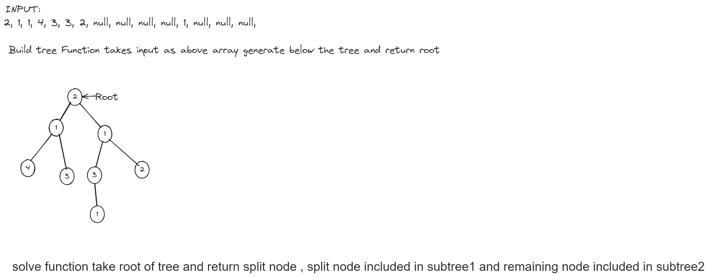
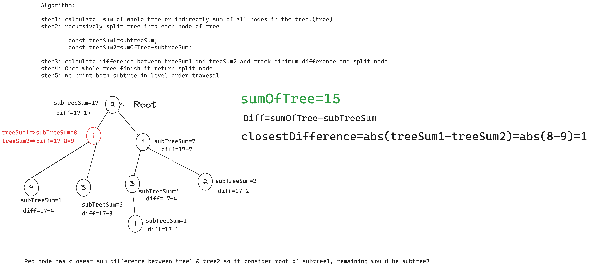
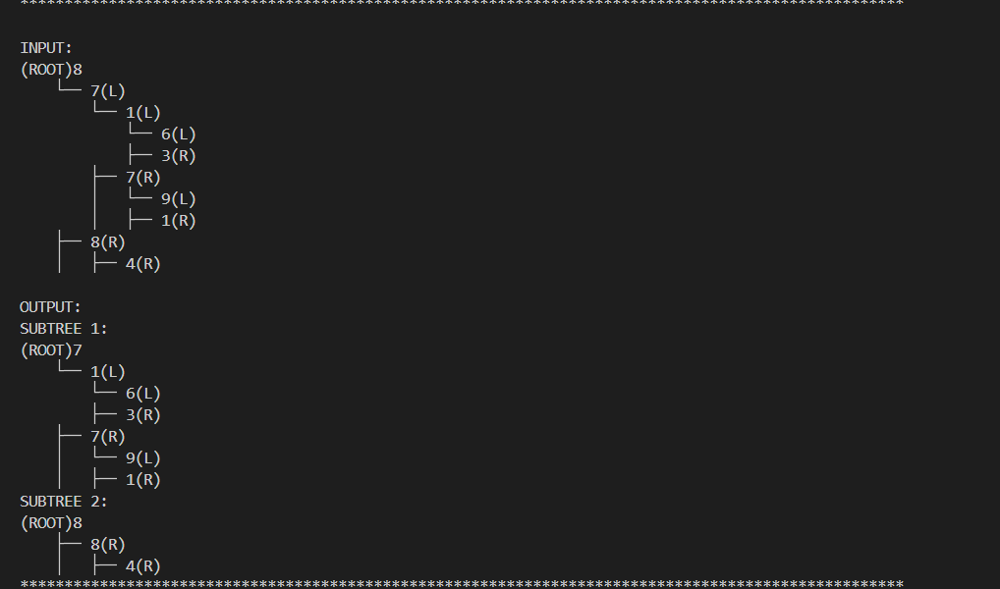
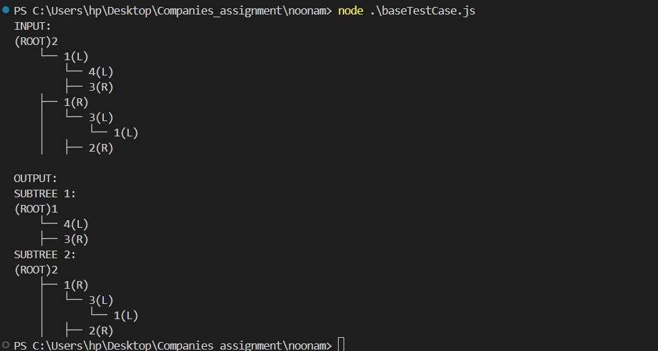

# Divide tree into subtree

## input formate


## algorithm


### example


##### Genrate input into input.txt
```js 
 node generateInput.js
```
#### Run the code
```js 
 node index.js
 ```

#### Run base testcase
```js 
 node .\baseTestCase.js
 ```
 
